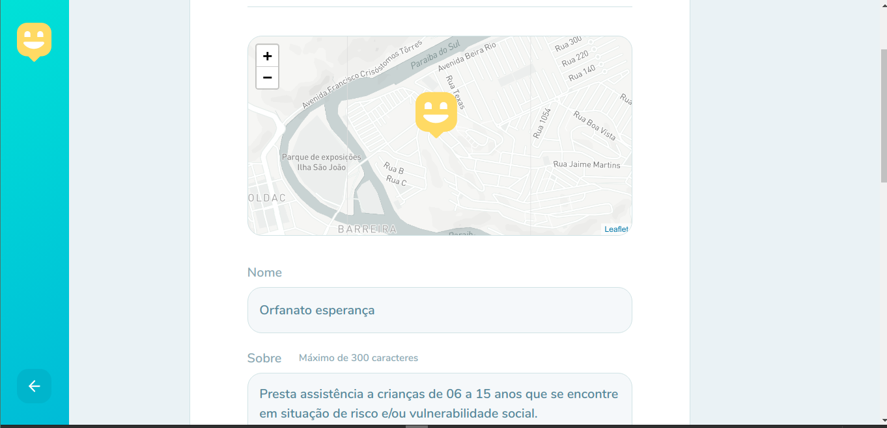

# Happy
Projeto criado na terceira NLW

O projeto é dividido em uma API rest pra cadastro de orfanatos e duas interfaces (web e mobile) que consomem essa API. O backend foi escrito em nodeJS, enquanto a interface web foi feita usando React e a interface mobile, usando React Native. O aplicativo mobile usa a abstração Expo para interagir com APIs nativas.

## Screenshots:
Que tal dar uma olhada em como o projeto ficou?

Imagens da interface web:




Imagens da interface mobile:


## Rodando a aplicação:

1 - Clone esse repositório

2 - Use o comando ```yarn``` para instalar as dependências, em cada uma das pastas (backend, mobile e web).
  (Nota: caso prefira usar o npm, primeiro apague o arquivo yarn.lock e então execute o comando ```npm install```, em cada uma das pastas.)

3 - Configure os arquivos com variáveis de ambiente. Cada pasta tem um arquivo de exemplo.

3 - No backend, crie o arquivo de database e suas tabelas executano o comando ```yarn typeorm migration:run```

4 - Inicie o servidor backend, com o comando ```yarn dev```, dentro da pasta backend

5 - Com o backend rodando, execute ```yarn start``` na pasta web ou na pasta mobile para rodar a interface.

Obs: Caso queira testar a interface web, será necessário baixar o aplicativo Expo.